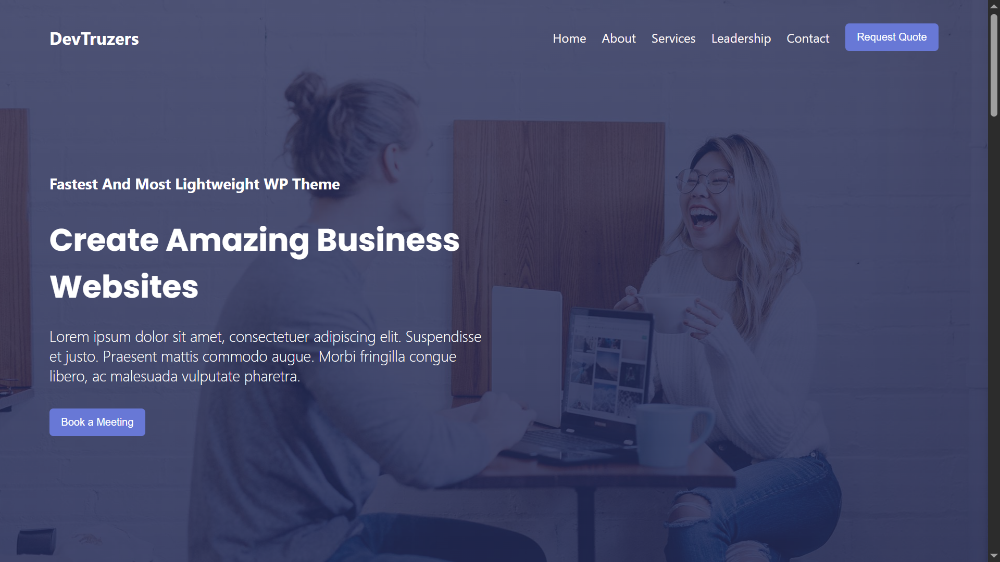

# Agency Website Clone (Practice Project)

A pixel-perfect, fully responsive front-end clone of the [Astra Agency Demo Template](https://websitedemos.net/agency-02/).

This project was built from scratch as a structured practice environment to master modern CSS layout engines, responsive web design principles, and semantic HTML structure.

---

## 🚀 Key Implementations

This project focuses on executing industry-standard layout architectures and ensuring seamless device adaptability:

### 1. 📐 CSS Grid Layout

- Used for complex, two-dimensional structures like the portfolio section, multi-column services grids, and team showcases.
- Implemented flexible track sizing via `grid-template-columns: repeat(auto-fit, minmax(300px, 1fr))` to create layout containers that dynamically adjust without explicit media queries.

### 2. 🔀 CSS Flexbox

- Leveraged for one-dimensional distribution of content where alignment and distribution are critical.
- Core use cases include the positioning of elements inside the navigation bar, ordering header call-to-actions, centering text content vertically within hero banners, and structuring the social icon distributions.

### 3. 📱 Full Responsiveness & Mobile-First Design

- Designed with a fluid grid system utilizing relative units (`rem`, `em`, `%`, `vh`, `vw`) instead of hardcoded pixel counts.
- Hand-crafted CSS media queries targeting strategic breakpoints (e.g., `768px`, `1024px`) to gracefully scale font sizes, margins, padding, and structural layouts from mobile devices up to large desktop viewports.

### 4. 🧭 Semantic Navigation Bar (Navbar)

- Built a clean, accessible, and sticky/fixed header component that stays anchored at the top of the viewport during scrolling.
- Implemented a responsive mobile drawer menu pattern (e.g., a slide-out drawer or vertical stack triggered via checkbox hack/minimal JavaScript) ensuring intuitive navigation across touchscreen environments.

---

## 🎯 Purpose of the Project

This website is a **functional clone** created strictly for **educational and practice purposes**.
The main goals achieved during this sprint were:

- Translating a production-ready template design into raw, semantic HTML and custom CSS.
- Mastering the overlap and alignment capabilities of CSS Grid vs the content-driven flexibility of CSS Flexbox.
- Strengthening debugging skills across different browser inspectors and responsive emulation modes.

---

## 🛠️ Tech Stack Used

- **HTML5:** Semantic architecture (`<header>`, `<nav>`, `<main>`, `<section>`, `<footer>`).
- **CSS3:** Custom properties (CSS variables) for design-tokens, Flexbox, CSS Grid, and custom transitions/animations.
- **FontAwesome:** Integrated via CDN for high-fidelity vector icons (social media, service identifiers).
